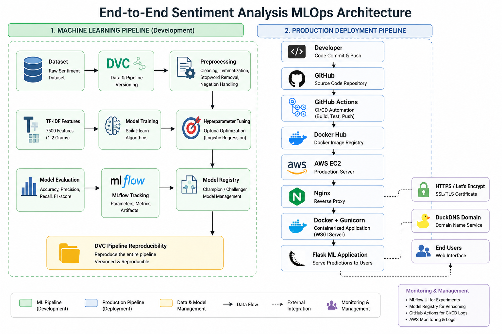

# 🚀 End-to-End Sentiment Analysis MLOps Pipeline

> A production-oriented Machine Learning project demonstrating an end-to-end MLOps workflow using **Scikit-learn, DVC, MLflow, DagsHub, Flask, Docker, and GitHub Actions**.

The project covers the complete machine learning lifecycle—from data ingestion and preprocessing to feature engineering, model training, experiment tracking, model registry, automated pipelines, testing, containerization, and deployment readiness.

---

## 🎯 Project Highlights

- ✅ End-to-End Machine Learning Pipeline
- ✅ Automated Data Versioning using DVC
- ✅ Experiment Tracking with MLflow + DagsHub
- ✅ Champion / Challenger Model Registry
- ✅ TF-IDF Feature Engineering
- ✅ Optuna Hyperparameter Tuning
- ✅ Automated CI using GitHub Actions
- ✅ Dockerized Flask Application
- ✅ Automated Unit Testing (PyTest)
- ✅ Production-Oriented Project Structure

---
## 🛠️ Quick Tech Stack

Python • Scikit-learn • TF-IDF • Optuna • MLflow • DVC • Flask • Docker • GitHub Actions


# 📖 Project Overview

Sentiment analysis is one of the most common Natural Language Processing (NLP) tasks used to identify whether a piece of text expresses a positive or negative sentiment. While many sentiment analysis projects focus only on model training, real-world machine learning systems require much more than achieving good accuracy.

This project demonstrates a complete **end-to-end MLOps workflow** for binary sentiment analysis. It covers the entire machine learning lifecycle, including data ingestion, text preprocessing, feature engineering, model training, hyperparameter tuning, experiment tracking, model versioning, automated testing, continuous integration, and containerized deployment.

The project was developed with a production-oriented mindset, where every stage of the pipeline is reproducible, version-controlled, and automated. Tools such as **DVC**, **MLflow**, **DagsHub**, **Docker**, and **GitHub Actions** were integrated to simulate the workflow commonly followed by machine learning engineers in industry.

Rather than focusing only on building a predictive model, this repository demonstrates how to build, track, test, and maintain a machine learning system that is easier to reproduce, deploy, and scale.

---

## 🎯 Project Objectives

- Build an end-to-end sentiment analysis pipeline.
- Apply robust text preprocessing and TF-IDF feature engineering.
- Compare different machine learning algorithms.
- Optimize model performance using Optuna.
- Track experiments with MLflow.
- Version datasets and pipelines using DVC.
- Register models using the Champion–Challenger approach.
- Automate testing using PyTest.
- Automate pipeline validation using GitHub Actions.
- Containerize the application using Docker.
- Deploy the application as a production-oriented service on AWS EC2.

---

# 🏗️ Project Architecture


```text
                         Raw Dataset
                              │
                              ▼
                       Data Ingestion
                              │
                              ▼
                     Text Preprocessing
              (Cleaning + Lemmatization +
              Stopword Removal + Negation Handling)
                              │
                              ▼
                  TF-IDF Feature Engineering
                  (7500 Features, 1-2 Grams)
                              │
                              ▼
                  Model Training (Scikit-learn)
                              │
                              ▼
                Hyperparameter Tuning (Optuna)
                              │
                              ▼
                       Model Evaluation
                              │
                              ▼
                  MLflow Experiment Tracking
                              │
                              ▼
                    Model Registration
                (Champion / Challenger Strategy)
                              │
                              ▼
                     DVC Pipeline Versioning
                              │
                              ▼
                    Flask Web Application
                              │
                              ▼
                    Docker Containerization
                              │
                              ▼
              GitHub Actions Continuous Integration
                              │
                       CI Success
                              │
                              ▼
             GitHub Actions Continuous Deployment
                              │
                              ▼
                  GitHub OIDC Authentication
                              │
                              ▼
                  AWS IAM Deployment Role
                              │
                              ▼
              AWS Systems Manager (SSM)
                              │
                              ▼
                       AWS EC2 Instance
                              │
                              ▼
                      Docker Container
                              │
                              ▼
                     Gunicorn + Flask
                              │
                              ▼
                    Nginx Reverse Proxy
                              │
                              ▼
                  HTTPS / Let's Encrypt
                              │
                              ▼
                    DuckDNS Production URL
                              │
                              ▼
                   🚀 Production Application
```

---

## Pipeline Components

| Stage | Description |
|--------|-------------|
| Data Ingestion | Loads the raw dataset and creates train/test splits. |
| Text Preprocessing | Cleans text, removes noise, performs lemmatization, and preserves important negation words such as **not** and **never**. |
| Feature Engineering | Converts text into TF-IDF vectors using **7500 features** with **unigrams and bigrams**. |
| Model Training | Trains the selected machine learning model using the configured pipeline. |
| Hyperparameter Tuning | Uses Optuna to search for better Logistic Regression hyperparameters. |
| Model Evaluation | Calculates Accuracy, Precision, Recall, and F1-score. |
| MLflow Tracking | Logs parameters, metrics, and trained models. |
| Model Registry | Registers new models and compares them using a Champion–Challenger workflow. |
| DVC Pipeline | Reproduces the complete ML pipeline and versions pipeline outputs. |
| Flask Application | Provides a web interface for sentiment prediction. |
| Docker | Packages the application into a portable container. |
| GitHub Actions | Automatically validates the pipeline and runs tests on every push. |


# 🛠️ Technology Stack

| Category | Technology | Purpose |
|----------|------------|---------|
| Programming Language | Python 3.11 | Core development language |
| Data Processing | Pandas, NumPy | Data loading and preprocessing |
| NLP | NLTK | Text cleaning, lemmatization, stopword handling |
| Feature Engineering | TF-IDF Vectorizer | Text vectorization (7500 features, unigram + bigram) |
| Machine Learning | Scikit-learn | Model training and evaluation |
| Hyperparameter Tuning | Optuna | Automated hyperparameter optimization |
| Experiment Tracking | MLflow + DagsHub | Experiment logging and artifact tracking |
| Model Registry | MLflow Model Registry | Champion–Challenger model management |
| Pipeline Orchestration | DVC | Data and pipeline versioning |
| Web Framework | Flask | Web application for predictions |
| Testing | PyTest | Automated unit and regression testing |
| Containerization | Docker | Portable deployment environment |
| Continuous Integration | GitHub Actions | Automated pipeline validation |

---

## 📦 Python Libraries

- pandas
- numpy
- scikit-learn
- nltk
- optuna
- mlflow
- dagshub
- dvc
- flask
- pytest
- joblib


# 🔄 ML Pipeline Workflow

| Step | Description |
|------|-------------|
| 1 | Load the raw sentiment dataset and split it into training and testing sets. |
| 2 | Clean and preprocess the text using normalization, lemmatization, and negation-aware preprocessing. |
| 3 | Convert processed text into TF-IDF features (7500 features with unigrams and bigrams). |
| 4 | Compare feature configurations to select the best representation. |
| 5 | Optimize Logistic Regression hyperparameters using Optuna. |
| 6 | Train the final model using the selected configuration. |
| 7 | Evaluate the model using Accuracy, Precision, Recall, and F1-score. |
| 8 | Track experiments, metrics, and artifacts with MLflow and DagsHub. |
| 9 | Register trained models using the Champion–Challenger strategy. |
| 10 | Reproduce the pipeline using DVC and serve predictions through the Flask application. |

# 📊 Results

## Final Model Performance

| Metric | Value |
|---------|------:|
| Accuracy | **81.05%** |
| Precision | **80.06%** |
| Recall | **81.56%** |
| F1 Score | **80.80%** |

---

## Best Feature Configuration

| Parameter | Selected Configuration |
|-----------|------------------------|
| Vectorizer | TF-IDF |
| Max Features | **7500** |
| N-gram Range | **(1, 2)** *(Unigrams + Bigrams)* |
| Negation Handling | **Enabled** |

---

## Best Hyperparameters

| Parameter | Value |
|-----------|------:|
| Algorithm | Logistic Regression |
| C | **2.8238** |
| Solver | **lbfgs** |
| Penalty | **l2** |
| Max Iterations | **1000** |

---

## Project Validation

| Component | Status |
|-----------|--------|
| DVC Pipeline | ✅ Passed |
| MLflow Tracking | ✅ Passed |
| Model Registry | ✅ Passed |
| Docker Build | ✅ Passed |
| GitHub Actions CI | ✅ Passed |
| Automated Tests | ✅ **9 / 9 Passed** |

# 📂 Project Structure

```text
emotion-detection-using-mlflow-dvc/

├── .github/
│   └── workflows/
│       ├── ci.yml                # GitHub Actions CI
│       └── cd.yml                # GitHub Actions CD
│
├── artifacts/                      # Trained model & vectorizer
│
├── data/
│   ├── raw/
│   ├── interim/
│   └── processed/
│
├── flask_app/                      # Flask web application
│
├── reports/                        # Evaluation metrics & benchmark results
│
├── requirements/                   # Dependency files
│
├── src/
│   ├── config/
│   ├── data/
│   ├── preprocessing/
│   ├── features/
│   ├── model/
│   ├── tuning/
│   └── evaluation/
│
├── tests/                          # Automated tests
│
├── Dockerfile
├── dvc.yaml
├── params.yaml
└── README.md
```

---

## 📁 Directory Overview

| Directory | Purpose |
|-----------|---------|
| `src/` | Core machine learning pipeline implementation |
| `data/` | Raw, intermediate, and processed datasets |
| `artifacts/` | Saved model, vectorizer, and pipeline artifacts |
| `reports/` | Evaluation metrics and benchmark results |
| `tests/` | Automated unit and regression tests |
| `flask_app/` | Flask application for inference |
| `.github/workflows/` | GitHub Actions CI workflow |
| `requirements/` | Project dependency files |

# 🚀 Quick Start

### 1️⃣ Clone the Repository

```bash
git clone https://github.com/kush2501/emotion-detection-using-mlflow-dvc.git

cd emotion-detection-using-mlflow-dvc
```

### 2️⃣ Create a Virtual Environment

```bash
python -m venv venv

# Windows
venv\Scripts\activate

# Linux / macOS
source venv/bin/activate
```

### 3️⃣ Install Dependencies

```bash
pip install -r requirements.txt
```

### 4️⃣ Run the DVC Pipeline

```bash
dvc repro
```

### 5️⃣ Launch the Flask Application

```bash
python flask_app/app.py
```

Open your browser:

```text
http://localhost:5000
```

---

## 📝 Note

The complete machine learning pipeline can be reproduced using:

```bash
dvc repro
```

This automatically executes all pipeline stages in the correct order whenever dependencies or parameters change.

---

# 🧪 Testing

The project includes automated tests to verify the correctness of the trained model, vectorizer, and Flask application.

### Run All Tests

```bash
python -m pytest tests -v
```

### Current Test Coverage

| Test | Status |
|------|--------|
| Flask Home Page | ✅ |
| Positive Prediction | ✅ |
| Negation Prediction | ✅ |
| Negative Prediction | ✅ |
| Model Loading | ✅ |
| Vectorizer Loading | ✅ |
| Model & Vectorizer Compatibility | ✅ |

**Result**

```text
9 tests passed
```

---

## 🔍 Continuous Integration

Every push to the `main` branch automatically triggers GitHub Actions to:

- Install project dependencies
- Verify the DVC pipeline
- Execute automated tests
- Validate the Docker build

This helps ensure that code changes do not break the project pipeline.


## 🚀 Continuous Deployment

The project also includes an automated deployment workflow using GitHub Actions.

When the deployment workflow runs:

1. GitHub Actions authenticates with AWS using GitHub OIDC.
2. AWS IAM grants temporary credentials through the deployment role.
3. GitHub Actions uses AWS Systems Manager (SSM) to send deployment commands to the EC2 instance.
4. SSM executes the Docker deployment commands directly on the EC2 instance.
5. The production container is restarted and verified automatically.

This provides an automated path from the repository to the production environment.

---

# 🐳 Docker

The application is containerized using Docker, providing a consistent runtime environment across different systems. This simplifies setup, improves reproducibility, and makes the project deployment-ready.

### Build Docker Image

```bash
docker build -t emotion-detection .
```

### Run Docker Container

```bash
docker run -d -p 5000:5000 emotion-detection
```

Open the application:

```text
http://localhost:5000
```

---

# 🚀 Production Deployment

The application has been deployed as a production-oriented Machine Learning service on AWS EC2.

### 🔐 Current Production Deployment Flow

```text
GitHub Push
    ↓
GitHub Actions CI
    ↓
CI Success
    ↓
GitHub Actions CD
    ↓
GitHub OIDC Authentication
    ↓
AWS IAM Deployment Role
    ↓
AWS Systems Manager (SSM)
    ↓
EC2 Instance
    ↓
Docker Container
    ↓
Gunicorn + Flask
    ↓
Nginx
    ↓
HTTPS
    ↓
DuckDNS Production Domain
    ↓
🚀 Production Flask ML Application

---

### 🔐 Deployment Security Note

SSH access is used only for manual EC2 administration and is restricted to trusted sources.

For local administration, SSH port 22 is restricted using the EC2 Security Group with **My IP**.

During CI/CD troubleshooting, temporary access from `0.0.0.0/0` was used only to verify GitHub Actions runner connectivity. After successful deployment verification, the rule was reverted to **My IP**.

The production application itself is exposed through **HTTPS on port 443**, while the Docker application port `5000` remains bound to `127.0.0.1` and is not directly exposed to the internet.


# 🔍 Monitoring & Troubleshooting

The production application can be monitored using Docker, Nginx, and system-level commands.

### Docker Monitoring

Check running containers:

```bash
docker ps

## Production Architecture

```text
GitHub Repository
        │
        ▼
GitHub Actions CI
        │
        ▼
CI Success
        │
        ▼
GitHub Actions CD
        │
        ▼
GitHub OIDC
        │
        ▼
AWS IAM Deployment Role
        │
        ▼
AWS Systems Manager (SSM)
        │
        ▼
AWS EC2
        │
        ├──────────────► Docker Hub
        │                 │
        │                 ▼
        │          Production Image
        │
        ▼
Docker Container
        │
        ▼
Gunicorn + Flask
        │
        ▼
Nginx Reverse Proxy
        │
        ▼
HTTPS / Let's Encrypt
        │
        ▼
DuckDNS Domain

## Production Components

| Component | Purpose |
|---|---|
| GitHub Actions | CI/CD automation |
| GitHub OIDC | Secure authentication from GitHub Actions to AWS |
| AWS IAM | Provides controlled deployment permissions |
| AWS Systems Manager (SSM) | Executes deployment commands on EC2 without SSH |
| AWS EC2 | Production server |
| Docker Hub | Container image registry |
| Docker | Application containerization |
| Gunicorn | Production WSGI server |
| Nginx | Reverse proxy and HTTPS termination |
| Let's Encrypt | SSL/TLS certificate |
| DuckDNS | Production domain |

## Production URL

https://emotion-mlops.duckdns.org

The application is served through HTTPS. Nginx acts as the reverse proxy and forwards requests to the Dockerized Flask application running through Gunicorn.

The Docker application is bound to `127.0.0.1:5000`, so the application port is not directly exposed to the public internet.

## Security

- HTTPS enabled using Let's Encrypt.
- HTTP requests are redirected to HTTPS.
- Security headers are configured in Nginx.
- SSH access is restricted through the AWS Security Group and is used only for manual EC2 administration.
- Production deployment does not depend on SSH; GitHub Actions uses AWS OIDC and Systems Manager (SSM).
- Application port `5000` is not publicly exposed.


# 🚀 Future Improvements

The current project demonstrates an end-to-end MLOps workflow with automated CI/CD and AWS production deployment. The following enhancements are planned for future versions:

- Implement model monitoring and performance tracking.
- Add data and concept drift detection.
- Build a REST API using FastAPI.
- Support multi-class emotion classification.
- Integrate model explainability using SHAP.
- Improve production scalability and infrastructure.

# 👨‍💻 Author

**Lovekush Kumar**

MCA Graduate | Aspiring Machine Learning & MLOps Engineer

- 💼 GitHub: https://github.com/kush2501
- 💻 Focus Areas: Machine Learning, NLP, MLOps, Docker, DVC, MLflow, CI/CD
- 📫 LinkedIn: *(Add your LinkedIn profile here)*

---

⭐ If you found this project useful, consider giving it a star.

# ✨ Repository Features

- End-to-end sentiment analysis pipeline
- Modular and configurable project structure
- Negation-aware text preprocessing
- TF-IDF feature engineering
- Feature configuration benchmarking
- Optuna hyperparameter optimization
- MLflow experiment tracking
- MLflow Model Registry (Champion–Challenger)
- DVC data and pipeline versioning
- Flask web application
- Dockerized application
- GitHub Actions CI
- Automated testing with PyTest

# 📜 License

This project is licensed under the MIT License.

See the **LICENSE** file for more details.


# 🙏 Acknowledgements

This project was built using several open-source tools and libraries, including:

- Scikit-learn
- MLflow
- DVC
- DagsHub
- Optuna
- Flask
- Docker
- GitHub Actions

Thanks to the open-source community for providing these excellent tools.